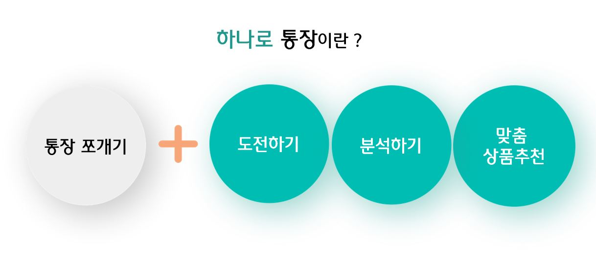
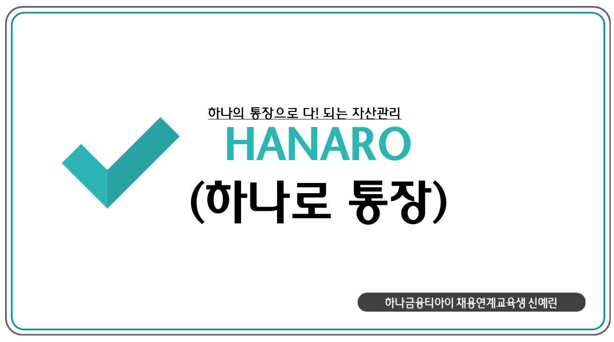
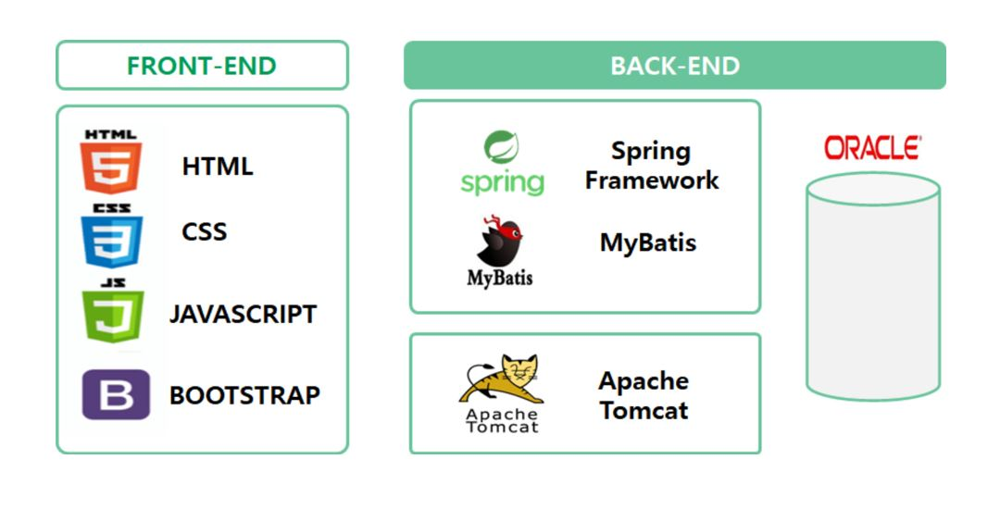

# HANARO 통장

[프로젝트 홈페이지 - https://koposoftware.github.io/2021_8_yrshin/](https://koposoftware.github.io/2021_8_yrshin/)

# 1. 프로젝트 개요
 
하나의 통장을 관리 목적에 따라 기본금, 생활금, 비상금으로 분리하여 관리하는 통장쪼개기 서비스에 자산관리 서비스를 더했습니다.

소비습관과 저축습관을 확립하지 못해 돈이 묶이는 예/적금 상품이 망설여지고, 여러 개의 통장관리가 부담스러웠던 사회 초년생들을 위한 분리형 통장으로 20대 고객 유입의 효과 또한 기대할 수 있습니다.

또한 카테고리 별 목표 소비 도전하기, 다양한 비교&분석과 월간  금융 레포트 , 맞춤 예/적금 추천 등 자산관리 서비스를 더하여 사용자들의 올바른 소비, 저축 습관의 형성을 돕는 것을 목적으로 합니다.

# 2. 프로젝트 제안서

프로젝트 제안서를 설명하세요. 발표자료와 동영상을 추가하세요. 시스템의 아키텍쳐 설명도 추가하세요.

   [하나로통장 제안서](./proposal_hanaro.pdf) 

 

# 3. 프로젝트 결과

## 발표 ppt 
   [발표자료](/project.pptx) 

## 시연 동영상 
 

## 수행 기간
 2021년 9월 6일 ~ 2021년 10월 5일
 
## 담당 업무

서비스 기획 및 설계, 데이터베이스 구축 및 Front-End, Back-End 개발

## 사용 기술
○ Spring MVC 기반 웹 어플리케이션 개발  
○ Java MailSender를 사용한 정기 메일 서비스  
○ CoolSMS API를 이용한 문자 알림 서비스 
○ FullCalendar 라이브러리를 활용한 자동 소비 달력   
○ Spring Scheduler를 사용한 매월 자동 통장 쪼개기와 고객 별 금융 레포트 생성 및 발송  
○ Oracle PL/SQL을 활용한 기능 모듈화와 재사용  
○ Kakao API를 사용한 소셜 로그인  

## 시스템 아키텍처
 
 
## ERD
 
 
# 4. 본인 소개

|항목|내용||
|-----|---------------------------|----|
|이름 |신예린||
|연락처 | dpfls0106(@)naver.com|
|skill set| Frontend - HTML, CSS, Javascript|
| | Backend - Java, Spring, Oracle, Python, Django |
|자격증| 정보처리기사, SQLD |
|수상| 입선- 고용노동부 주최 창업경진대회 |
|대외활동|멋쟁이 사자처럼 7, 8기 인천대학교 교육 담당 운영진(2019년.03월 ~ 2020년 11월)  → Python Django 교육 진행 및 웹 프로젝트 개발|
|특기사항|  TOEIC |

